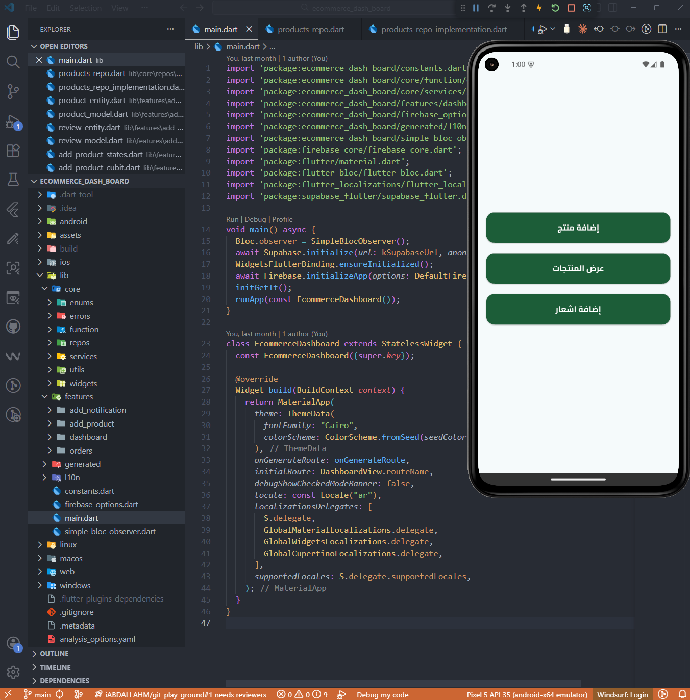
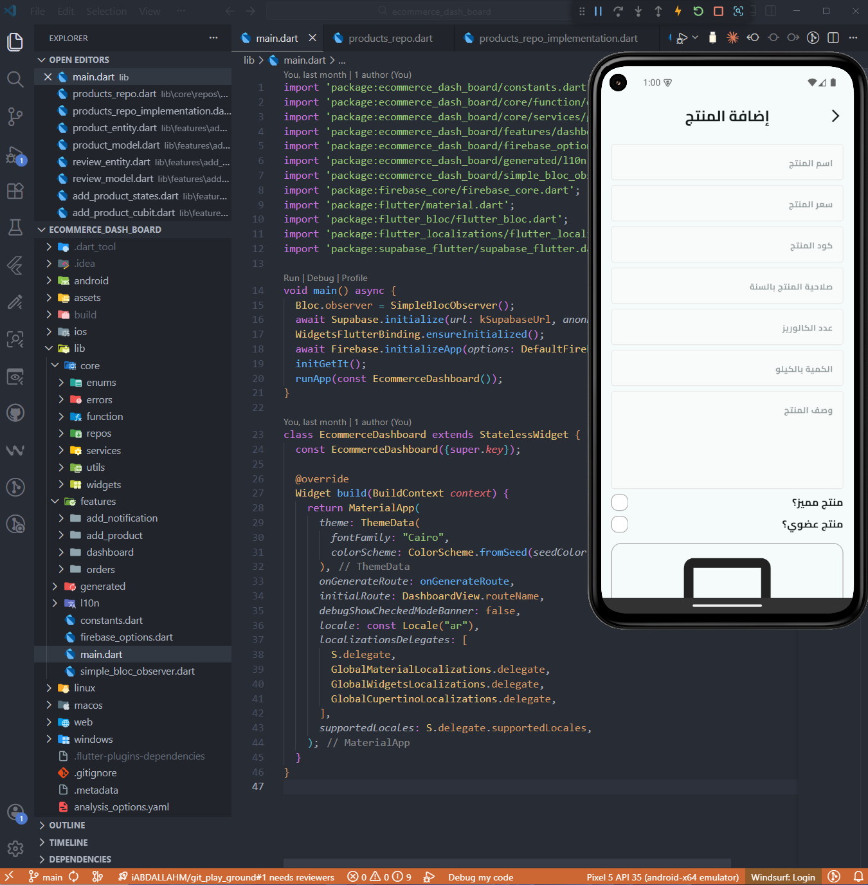
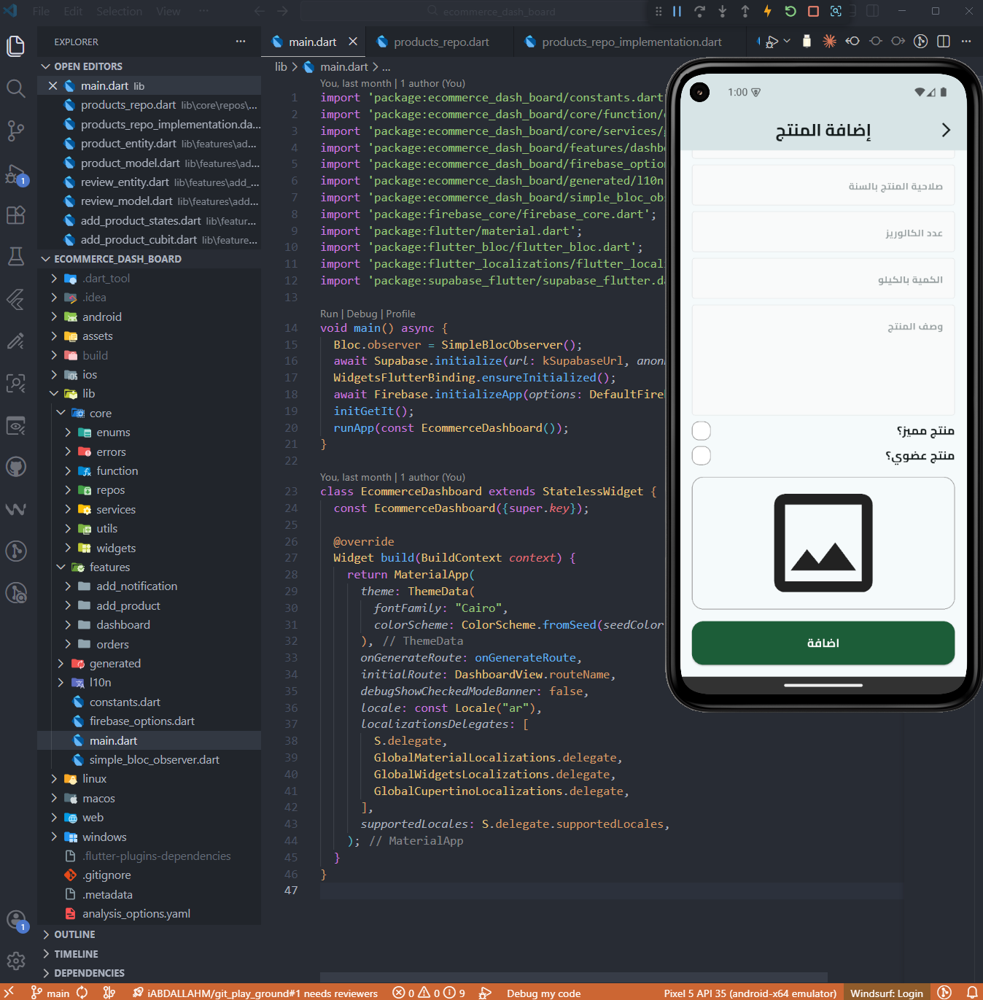
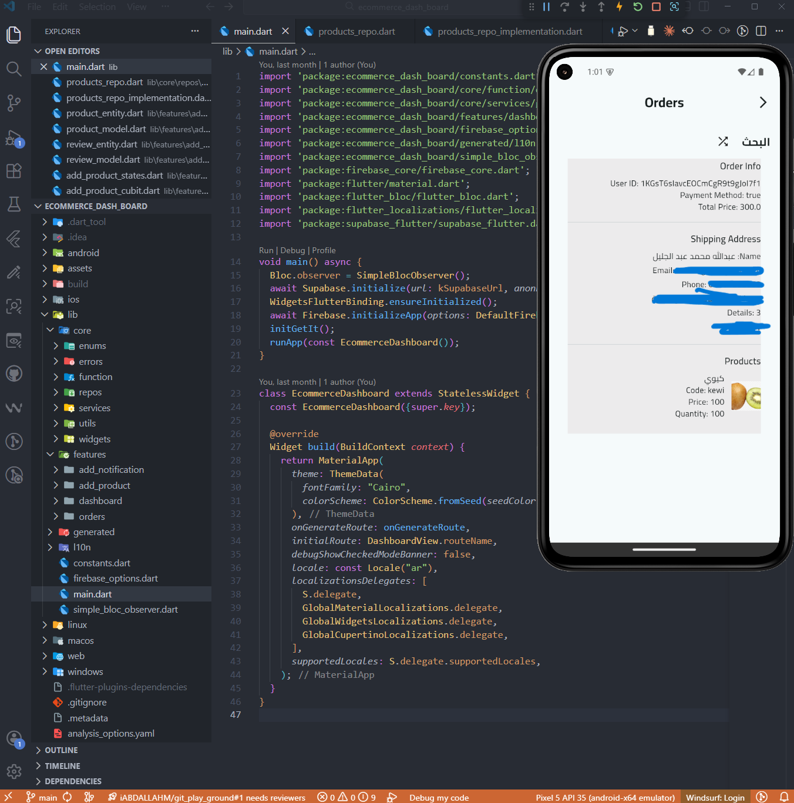
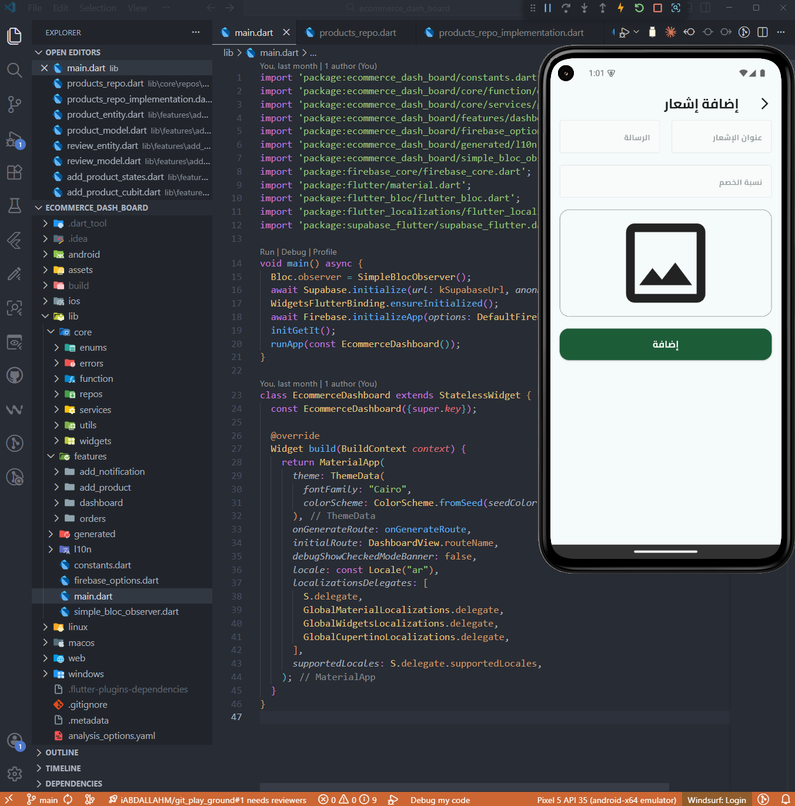

# FruitHub Dashboard 

## Descriptions

**FruitHub Dashboard** is a modern **Flutter-based admin dashboard** built using **Clean Architecture** principles to ensure scalability, maintainability, and clear separation of concerns. It provides administrators with an efficient interface to manage products, monitor data, and control different aspects of the FruitHub application.

The dashboard focuses on **structured architecture**, **reusable components**, **and clean project organization**, making it easy to extend and maintain. This project demonstrates how to build a **scalable and production-ready admin panel** using Flutter while following modern development best practices.

## ScreenShots

  
    
  
    
  
    
  
    
    
    

## Connect With Me

